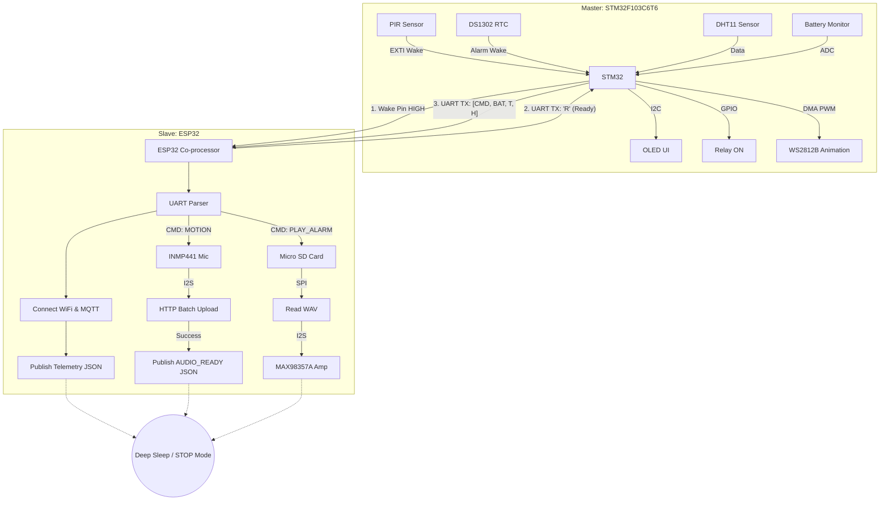

# Parrock Firmware

This repository contains the embedded software and hardware wiring documentation for the Parrock ecosystem.

The system is built around a **master-slave dual-MCU architecture** designed to balance ultra-low power consumption with heavy networking and audio capabilities.

## Overview

- **STM32 (Master):** Runs a highly optimized FreeRTOS environment. It stays in ultra-low power `STOP` mode most of the time. It wakes up via hardware interrupts (RTC alarm or PIR motion sensor), reads environmental data from the DHT11 sensor, manages the OLED UI and WS2812 animations, and wakes the ESP32 only when network or audio tasks are required.
- **ESP32 (Co-processor / Slave):** Remains in deep sleep until woken by the STM32. Once awake, it handles UART handshaking, connects to Wi-Fi and MQTT, publishes telemetry, and performs I2S audio recording from the INMP441 or playback through the MAX98357A from an SD card.

## Features

- Ultra-low power dual-MCU architecture
- Motion-triggered wake system (PIR + RTC)
- Wi-Fi + MQTT telemetry via ESP32
- I2S audio recording and playback
- OLED UI + WS2812 animations
- Battery monitoring

## Repository Contents

- `Stm32Parrock/` - STM32CubeIDE project written in C using FreeRTOS, HAL, and BSP.
- `ESP32Parrock/` - ESP-IDF project written in C using FreeRTOS, Wi-Fi, MQTT, HTTP Client, and I2S v5.

## Requirements

### Hardware
- STM32F103C6T6
- ESP32 Dev Board
- DHT11, PIR sensor
- Relay module (3.3V or 5V, logic-compatible)
- OLED 0.96" (I2C)
- WS2812B LEDs
- INMP441 microphone
- MAX98357A amplifier
- Mini buck converter (3.3V regulator)
- TP4056 battery module

### Software
- STM32CubeIDE
- ESP-IDF (v5.x recommended)

---

## Hardware Requirements and Wiring Guide

### HIGH-LEVEL Architecture Diagram



### 1. Power Distribution

To prevent MCU resets during heavy audio playback or LED usage, the power is divided into two rails:

- **V_RAW (3.7V - 4.2V):** Direct battery power from the TP4056 `OUT+` line for high-current components such as WS2812 LEDs, relay, and the MAX98357A amplifier.
- **3.3V Logic Bus:** Clean regulated power from a mini buck converter stepping V_RAW down to 3.3V for the MCUs and sensitive sensors.

> **Important:** Connect the 3.3V logic bus directly to the `3.3V` / `3V3` pins on both MCUs, bypassing internal regulators. All grounds (GND) must be tied together.

### 2. Master Domain - STM32F103C6T6

| Component | Power | Signal Connections | Notes |
|---|---|---|---|
| DHT11 | VCC / GND | DATA → **PA3** | Environmental sensor |
| PIR Sensor | VCC / GND | OUT → **PA0** | Motion trigger |
| OLED 0.96" | VCC / GND | SCL → **PB6**, SDA → **PB7** | I2C display |
| DS1302 RTC | VCC / GND | RST → **PB12**, DAT → **PB13**, CLK → **PB14** | `DAT` requires a 4.7kΩ pull-up |
| Relay | VCC / GND | IN1 → **PA4** | Powered from **V_RAW** |
| WS2812B | V+ / V- | IN → **PA6** | Add a 330Ω series resistor on the data line and a 1000µF capacitor across V+/V- |
| Battery Monitor | — | Divider midpoint → **PA1** | 10kΩ / 10kΩ voltage divider from TP4056 `B+` to GND |

### 3. Slave Domain - ESP32

| Component | Power | Signal Connections | Notes |
|---|---|---|---|
| Micro SD | 3V3 / GND | CS → **GPIO4**, MOSI → **GPIO23**, MISO → **GPIO19**, CLK → **GPIO18** | SPI storage |
| MAX98357A | VIN / GND | LRC → **GPIO25**, BCLK → **GPIO26**, DIN → **GPIO22**, GAIN → **GND**, SD → **3.3V** | Powered from **V_RAW** |
| INMP441 | VDD / GND | L/R → **GND**, SCK → **GPIO27**, WS → **GPIO21**, SD → **GPIO32** | Digital I2S microphone |

### 4. Inter-Board Bridge - STM32 ⇄ ESP32

For communication between both boards:

- **Wake Line:** STM32 **PA2** (`WAKE_ESP_Pin`) → ESP32 **GPIO 33**  
  Active-high level signal used to wake ESP32 from deep sleep via `ext0` wake source.  
  WAKE line is active-high and used to trigger ESP32 wake-up from deep sleep (ext0). It may remain HIGH during handshake, but ESP32 does not require it to stay high after wake-up unless enforced by firmware logic.
  
- **UART Communication (115200 baud):**
  - STM32 **PA9** (TX) → ESP32 **RX2**
  - STM32 **PA10** (RX) → ESP32 **TX2**   
  ESP32 uses UART2 mapped to GPIO16 (RX2) and GPIO17 (TX2).

---

## Flow of Execution

1. **Idle:** Both STM32 and ESP32 remain in deep sleep / `STOP` mode.
2. **Trigger:** PIR detects motion or the RTC triggers a morning alarm.
3. **STM32 Wake:** STM32 wakes up, reads the DHT11, turns on the OLED, and plays an LED animation.
4. **Wake ESP32:** STM32 pulls the wake line HIGH. ESP32 boots from deep sleep.
5. **Handshake:** ESP32 sends `R` (Ready) via UART. STM32 responds with a formatted telemetry frame such as `[CMD:MOTION][BAT:85%][T:22C][H:45%]`.
6. **Network and Audio:** ESP32 parses the frame, connects to Wi-Fi / MQTT, publishes telemetry, and streams audio to the backend (motion) or plays a WAV file (alarm).
7. **Sleep:** ESP32 returns to deep sleep. STM32 turns off peripherals and goes back to `STOP` mode.

### ⚠️ Important Note on STM32 Deep Sleep (STOP Mode) & Watchdog

Due to a hardware limitation in the STM32F1xx silicon (specifically the STM32F103C6T6 used in this project), the Independent Watchdog (IWDG) cannot be frozen in `STOP` mode via Option Bytes. The internal LSI oscillator continues to run, and if the IWDG is enabled, it will continue counting and may reset the MCU after its timeout period, even while the system is in `STOP` mode.

**Note:** `STOP` mode itself does not cause resets; the reset behavior is solely caused by the enabled hardware watchdog.

By default, the IWDG and the custom health-monitoring task (`TaskWatchdog_Entry`) are active in the codebase for robustness during active execution. While the software task monitors RTOS logic and can trigger a software-initiated system reset based on application logic, the hardware IWDG acts as the ultimate fail-safe.

**If you want to achieve true ultra-low power consumption and allow the system to sleep indefinitely:**
1. Open `task_comms.c` and uncomment the `HAL_PWR_EnterSTOPMode(...)` lines to enable deep sleep.
2. Open `main.c` and explicitly comment out `MX_IWDG_Init();` to prevent the hardware watchdog from starting.
3. Comment out `HAL_IWDG_Refresh(&hiwdg);` before the RTOS kernel starts.
4. *(Optional)* Disable the creation of `WatchdogTaskHandle` to save RAM and disable the software watchdog logic entirely.

---

## Build and Flash

### 1. STM32 (`Stm32Parrock`)

This project is configured for STM32CubeIDE.

1. Open STM32CubeIDE.
2. Import the `Stm32Parrock` folder as an existing project.
3. Build the project using `Project -> Build All`.
4. Connect the ST-Link programmer to the STM32 (`3.3V`, `GND`, `SWDIO`, `SWCLK`).
5. Click `Run -> Debug` or `Run -> Run` to flash the firmware.

### 2. ESP32 (`ESP32Parrock`)

This project uses the Espressif IoT Development Framework (ESP-IDF).

1. Open an ESP-IDF terminal.
2. Navigate to the ESP32 project folder:

   ```bash
   cd firmware/ESP32Parrock
   ```

3. Set the target if it has not been set yet:

   ```bash
   idf.py set-target esp32
   ```

4. Build, flash, and monitor the project:

   ```bash
   idf.py -p /dev/ttyUSB0 flash monitor
   ```

   Replace `/dev/ttyUSB0` with your serial port, or use `COM3` on Windows.

---

## Folder Layout

```plaintext
firmware/
├── ESP32Parrock/              # ESP-IDF project (Wi-Fi, MQTT, audio streams)
│   ├── CMakeLists.txt
│   ├── main/
│   ├── components/
│   │   ├── audio_player/
│   │   ├── audio_recorder/
│   │   ├── board_config/
│   │   └── sd_card_mgr/
└── Stm32Parrock/              # STM32CubeIDE project (FreeRTOS, UI, sensors, logic)
    ├── .cproject
    ├── Stm32Parrock.ioc
    ├── Core/
    ├── App/
    ├── Drivers/
    ├── Config/
    └── Services/
```
